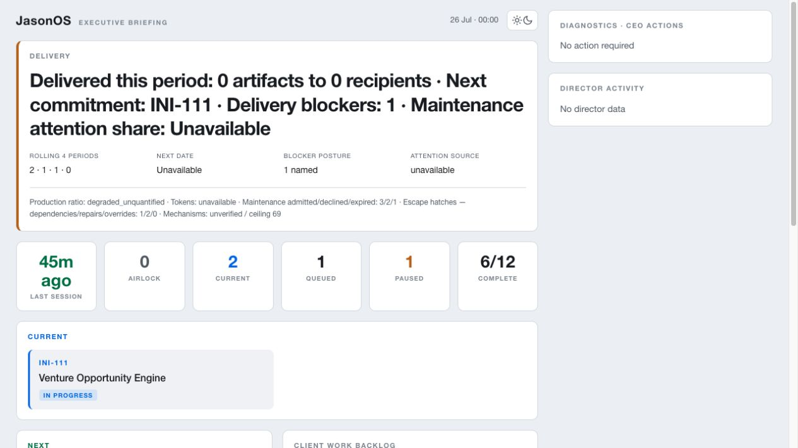
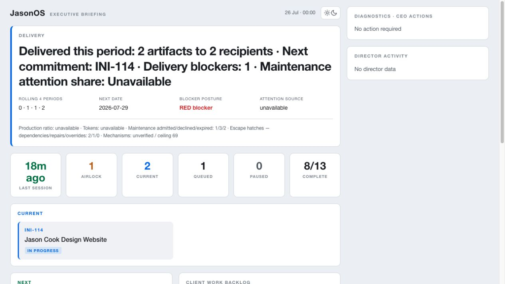

# Tranche 4 Pro-dashboard visual evidence

Captured 2026-07-26 from the actual `pro/index.html` renderer at a 1265×712
viewport, using the public-safe fixtures in `../fixtures/`.

## Zero delivery

- headline: `0 artifacts`, `0 recipients`, next `INI-111`, one blocker;
- production ratio: `degraded_unquantified`;
- attention and tokens explicitly unavailable;
- maintenance lifecycle, escape hatches, and mechanism ceiling visible below
  the headline;
- headline bounds: x 25.59, y 65, width 837.81, height 306.58;
- horizontal overflow: false;
- SHA-256:
  `c7de1a3d3aa9aa1241b78f87cb262f44371f089c2aa768b0dda4f7aeb8fc339d`.

## Productive period

- headline: `2 artifacts`, `2 recipients`, next `INI-114`, one blocker;
- Red blocker rendered prominently;
- attention and tokens explicitly unavailable;
- maintenance lifecycle, escape hatches, and mechanism ceiling visible below
  the headline;
- headline bounds: x 25.59, y 65, width 837.81, height 306.58;
- horizontal overflow: false;
- SHA-256:
  `34ff244effd9185ba01f0b5c2b799221728574815e16d086de4be4fd9ae40f46`.

These are test evidence only. They are not generated projections and are not
served by the production dashboard.

